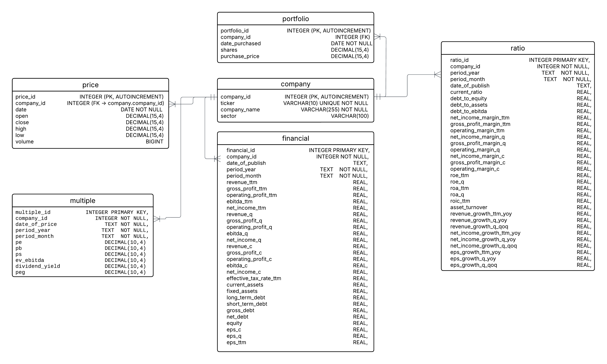

# Database Design

The purpose of this document is to explain the database structure, design selections, data sources and maintainance strategy.

## ER Diagram and Data Dictionary

You can check the ER diagram, I have created:

## Tables and Rationale

company: basic information about companies 
price: stock price information
financial: some basic financials about stocks
ratio: ratios calculated from financials
portfolio: assets in portfolio and some other information

- Why are there 5 different tables (**normalization**)?

It prevents data repetition, we might have same information many times if normalization was not done. However, denormalization would might be faster. Normalization is more academic approach for now.
For example when price data is wanted to be updated, nothing will change in financial table which prevenets data repetition.

- I will **calculate the ratios myself**. What is the reason behind this choice, why aren't external sources used?

External sources might have different approaches when calculating ratios, there might be definition differences. Also, calculating the ratios myself will be a part of the education, it will be practical. I will know which formula will be used.

- What are data sources?

For the price data, the source will be **yfinance** API. It contains all the daily price data for BIST. The disadvantages might be query limit, inaccuracy and slow performance. The alternatives are mostly expensive and not suitable for test edition. In the future, Matriks can be used for BIST data.
For the financial data, skorkart repo will be tried. It is not deeply investigated. The alternatives are manually loading data, TradingView API, Investing.com API.

- I will store the data in **SQLite**. Why SQLite is chosen? 

The main reason is I learnt SQLite in the course but for language it might not be that difficult to also learn other languages. However, it says SQLite is easy to build and ideal for small amount of data. On the other hand, managing a system like PostgreSQL would increase the learning curve a lot. In the future, I might change the system to PostgreSQL.

## Maintainance of data

Price data will be updated daily with python scripts written. Financials data will be updated as new financials come, approximately by 3 months.
In this way, it won't exceed API limit and reduce unnecessary processing load.

There will be incremental update, only new data will be added, nothing will happen to old data.

If there is a company division, script will handle it.

Why not do automation now?

Automating at the beginning of a project would be premature optimization. First, I need to understand the data flow by running the scripts manually. Once everything is stable (the data model is established), automation makes sense.

## Logging & Error Handling

Logging is necessary to know when the data is extracted. If there is an error, it will be crucial to see where the error occurred and at what point it broke. 

## Backup & Recovery

Data sources may be lost, repos may be closed, or APIs may change.

Backup → Excel CSV, manual input, or switching to another API.

This way, the system doesn't completely collapse.

