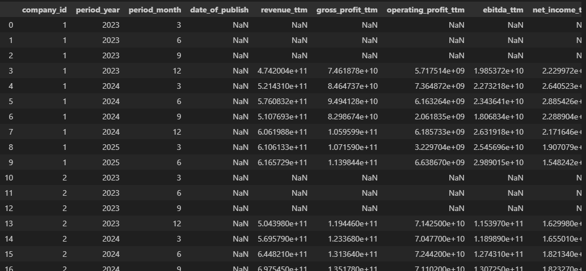

# Document: Fetching Financial Data with `isyatirimhisse`

## Overview

The goal of this step was to fetch financials data for stocks from İş Yatırım and insert it into our local SQLite database. Actually, skorKart was selected for this purpose but it is seen that it does not include all the financials that are wanted. About the things I tried, [test_fetch_financials.ipynb](test_fetch_financials.ipynb)) can be checked.

The process of fetching data can be divided into three main parts:

1. Selecting the tickers

2. Fetching the data from isyatirimhisse and cleaning it

3. Inserting the data into the database


## 1. Selecting the tickers

Same principles are used, that were discussed in [fetch_prices.mb](fetch_prices.mb)). There is a dictionary contains tickers as keys and company_id as values.

```
ticker_dict = {"THYAO":1,"BIMAS":2}
```

## 2. Fetching the data from isyatirimhisse and cleaning it

This library also has multiple ticker feature, so multiple data from different stocks can be fetched at the same time. The library gives all the financial information possible.

```
df = fetch_financials(
    symbols=list(ticker_dict.keys()),
    start_year=2025,
    end_year=2025,
    exchange="TRY",
    financial_group='1',
    save_to_excel=False
)
```

The format of the table is converted into our database format:

```
df.drop(['FINANCIAL_ITEM_NAME_TR',"FINANCIAL_ITEM_CODE"], axis=1, inplace=True)  

df_melted = df.melt(
    id_vars=['FINANCIAL_ITEM_NAME_EN', 'SYMBOL'],
    var_name='Period',
    value_name='Value'
)

df_melted['Value'] = pd.to_numeric(df_melted['Value'], errors='coerce')

df_pivoted = df_melted.pivot_table(
    index=['SYMBOL', 'Period'],
    columns='FINANCIAL_ITEM_NAME_EN',
    values='Value'
).reset_index()
df_pivoted.columns.name = None
```

The data cleaning part was quite difficult. Names were different, some data were calculated directly from the data.
Other than that, column names are lowercased, spaces replaced with underscores, renamed to consistent English financial terms (revenue, gross_profit, net_income, etc.).

```
df_pivoted = df_pivoted.rename(columns={'net_sales': 'revenue_c',"gross_profit_(loss)": "gross_profit_c","operating_profits":"operating_profit_c","net_profit_after_taxes":"net_income_c","long_term_liabilities":"long_term_debt","short_term_liabilities":"short_term_debt","shareholders_equity":"equity","taxation_on_continuing_operations":"taxation_on_continuing_operations_c","profit_before_tax_from_continuing_operations":"profit_before_tax_from_continuing_operations_c","diluted_earnings_per_share":"eps_c"})
df_pivoted['ebitda_c'] = (df_pivoted['gross_profit_c'] - 
               df_pivoted['marketing_selling_&_distrib._expenses_(-)'].abs() -
               df_pivoted['general_administrative_expenses_(-)'].abs() - 
               df_pivoted['research_&_development_expenses_(-)'].abs() +
               df_pivoted['depreciation_&_amortization'])
df_pivoted['fixed_assets'] = df_pivoted['total_assets'] - df_pivoted['current_assets']
df_pivoted['gross_debt'] = (
    df_pivoted['short-term_financial_loans'] + 
    df_pivoted['long-term_financial_loans'] + 
    df_pivoted['other_short-term_financial_liabilities'] +
    df_pivoted['short-term_loans_from_financial_operations'] + 
    df_pivoted['long-term_loans_from_financial_operations']
)
df_pivoted['net_debt'] = df_pivoted['gross_debt'] - df_pivoted["cash\xa0and\xa0cash\xa0equivalents"] - df_pivoted['short-term_financial_investments']
df_pivoted['company_id'] = df_pivoted['symbol'].map(ticker_dict)
df_pivoted["date_of_publish"] = np.nan
df_pivoted[["period_year","period_month"]] = df_pivoted["period"].str.split("/",expand=True)
df_pivoted['period_month'] = pd.to_numeric(df_pivoted['period_month'])
df_pivoted['period_year'] = pd.to_numeric(df_pivoted['period_year'])

```

As expected, the API does not provide date of publish for financials. Another way will be thought for this later.

Cumulative data are converted into quarterly and ttm data by using vector operations for higher performance and then the wanted columns are selected.

```
df_pivoted = df_pivoted.sort_values(by=['company_id', 'period_year', 'period_month']).reset_index(drop=True)
kalemler = ["revenue","gross_profit","operating_profit","ebitda","net_income","taxation_on_continuing_operations","profit_before_tax_from_continuing_operations","eps"]

for kalem in kalemler:
    kalem_q = kalem + "_q"
    kalem_c = kalem + "_c"
    kalem_ttm = kalem + "_ttm"

    df_pivoted[kalem_q] = np.where(
        df_pivoted['period_month'] == 3,
        df_pivoted[kalem_c],
        df_pivoted.groupby(['company_id',"period_year"])[kalem_c].diff()
    )

    df_pivoted[kalem_ttm] = df_pivoted.groupby('company_id')[kalem_q].rolling(window=4).sum().values

df_pivoted["effective_tax_rate_ttm"] = df_pivoted["taxation_on_continuing_operations_ttm"] + df_pivoted["profit_before_tax_from_continuing_operations_ttm"]

df_pivoted = df_pivoted[['company_id',"period_year","period_month","date_of_publish","revenue_ttm","gross_profit_ttm","operating_profit_ttm","ebitda_ttm","net_income_ttm","revenue_q","gross_profit_q","operating_profit_q","ebitda_q","net_income_q","revenue_c","gross_profit_c","operating_profit_c","ebitda_c","net_income_c","effective_tax_rate_ttm","current_assets","fixed_assets","long_term_debt","short_term_debt","gross_debt","net_debt","equity","eps_c","eps_q","eps_ttm"]]
```

The resulting image looks like this:


## 3. Inserting data into the database

I chose to insert the whole dataframe once at the end. 
```
df_pivoted.to_sql('financial', conn, if_exists='append', index=False)
```

Indexes should not be transferred to database since there is a different indexes there, and there should be not problem about the arrangemnet since database matches as long as column names are same.


## Future Improvements:
- Add date_of_publish
- Error handling
isyatirimhisse can return empty DataFrame, this can lead error.
- Ticker dictionary
Company tickers can be taken from database or be stored in csv, etc for scalability.
- Control of data types
- Logging
- Solving duplicate data problem
- Making it more modular by separating it into functions.
- More data validation
- isyatirimhisse takes year input. When new financials are reported, the system can not only get those new financials due to lack of input. This should be fixed.
- When the the first financial data is cumulative Q4 data, it can not be converted into quarterly data, therefore can not be converted into ttm data. Solve this.