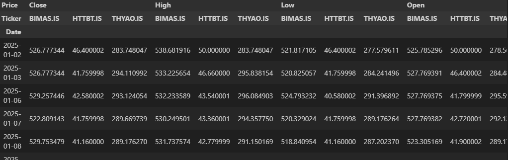
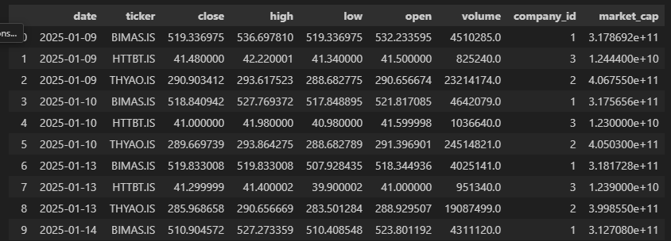

# Document: Fetching Price Data with `yfinance`

## Overview

The goal of this step was to fetch daily stock price data from Yahoo Finance and market cap data from isyatirimhisse,then insert it into our local SQLite database. The process can be divided into three main parts:

1. Selecting the tickers

2. Fetching the data with yfinance and isyatirimhisse

3. Inserting the data into the database


## 1. Selecting the tickers

I had two main options for determining which companies to fetch data for:

- Option A: Query the `company` table in the database and retrieve the list of tickers.

- Option B: Store tickers and their IDs in a dictionary inside the Python script.

Since there are about 500 BIST companies and the set of companies we track will be relatively stable, I decided to use a Python dictionary for performance and simplicity at this stage.

```
ticker_dict = {
    "BIMAS.IS": 1,
    "THYAO.IS": 2,
    # ticker : company_id
    # more tickers can be added here
}
```

Also, start and end dates are taken as inputs and converted into datetime object since yfinance and isyatirimhisse takes date inputs as different types.
```
start_date = '2025-01-09'
end_date = '2025-01-15'

start_date_object = datetime.strptime(start_date, "%Y-%m-%d")
end_date_object = datetime.strptime(end_date, "%Y-%m-%d")
```

## 2. Fetching the data from yfinance

I was reviewing the Yfinance official documentation. It describes **multiple ticker download feature** (`yf.download(["BIMAS.IS", "THYAO.IS"], ...)`). This was my first option. However, the resulting dataframe had a multi-level column index that did not align well with the schema of our database. For example:



As it can be seen, there were some pandas operations needed to convert this into the format in my database.

On the other hand, the second option was data can be taken ticker by ticker inside a for loop and then concatenated into a final dataframe at the end. This method were easy to code (indeed I did code it, you can check [test_fetch_prices.ipynb](test_fetch_prices.ipynb)).

However, second option was not better for performance and it may exceed API limit at some point in the project. Therefore first option is selected:

```
tickers = list(ticker_dict.keys())
data = yf.download(tickers, start='2025-01-01', end='2025-01-08')

# This line converts multi-level indexes into one level
# For example Close for BIMAS.IS becomes 'Close_BIMAS.IS'
data.columns = ['_'.join(col).strip() for col in data.columns.values]
data = data.reset_index()

# 'melt' function is used to convert the whole data into a few columns
data = pd.melt(data, id_vars=['Date'], var_name='ticker_info', value_name='value')
data[['data_type', 'ticker']] = data['ticker_info'].str.split('_', expand=True)
data.drop('ticker_info', axis=1, inplace=True)

# and then make it into desirable format with pivot tables
data = data.pivot_table(index=['Date', 'ticker'], columns='data_type', values='value').reset_index()
data.columns.name = None
data.columns = data.columns.str.lower()

# also add company_id
data['company_id'] = data['ticker'].map(ticker_dict)
```

Add market cap data from isyatirimhisse

```
mc_df = fetch_stock_data(
    symbols=[s[:-3] for s in tickers],
    start_date=start_date_object.strftime("%d-%m-%Y"),
    end_date=end_date_object.strftime("%d-%m-%Y"),
    save_to_excel=False
)
mc_df = mc_df[["HGDG_HS_KODU","HGDG_TARIH","PD"]]
mc_df = mc_df.rename(columns={"HGDG_HS_KODU": "ticker", "HGDG_TARIH": "date","PD":"market_cap"})
mc_df["ticker"] = mc_df["ticker"] + ".IS"
data = data.merge(
    mc_df,
    how="left",
    left_on=["ticker", "date"],
    right_on=["ticker", "date"]
)
data.drop('ticker', axis=1, inplace=True)
```

At the end the resulting image looks like this:


## 3. Inserting data into the database

I chose to insert the whole dataframe once at the end. 
```
data.to_sql('price', conn, if_exists='append', index=False)
```

Indexes should not be transferred to database since there is a different indexes there, and there should be not problem about the arrangemnet since database matches as long as column names are same.


## Future Improvements:
- Automating the dates
For now I write the wanted start and end dates manually. The the last date from database can be taken and the data from the last date to today can be written. 
- Error handling
yf.download can return empty DataFrame, this can lead error.
- Ticker dictionary
Company tickers can be taken from database or be stored in csv, etc for scalability.
- Control of data types
- Logging
- Solving duplicate data problem
- Making it more modular by separating it into functions.
- More data validation
- isyatirimhisse takes only year as an start and end inputs so when data is updated we need to take market cap data for whole year and then join that with yfinance data. Solve this.
- Test market_cap data deeper
